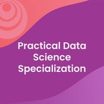
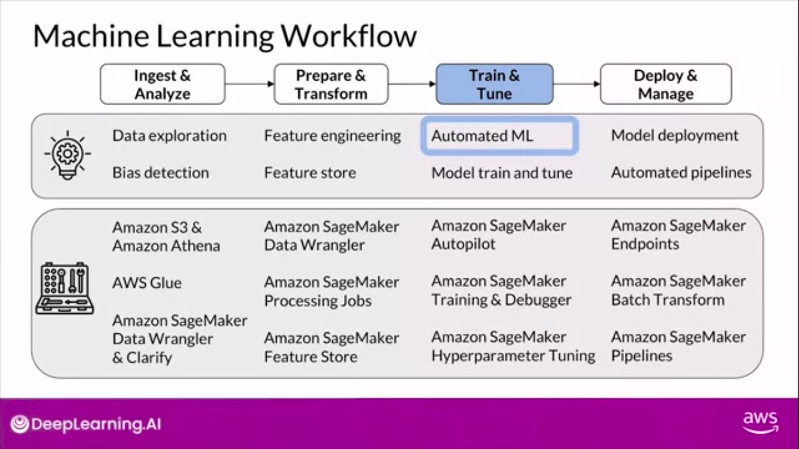
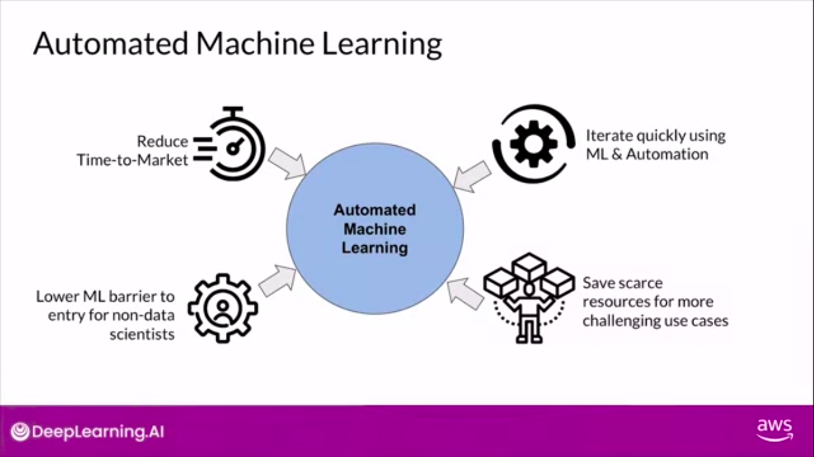

# Practical Data Science Specialization

This course mainly focused on developing data science projects in cloud using Amazon SageMaker.

### Machine Learning WorkFlow

01. Prepare data, detect statistical data biases, perform feature engineering at scale to train models, & train, evaluate, & tune models with AutoML.
02. Store & manage ML features using a feature store, & debug, profile, tune, & evaluate models while tracking data lineage and model artifacts.
03. Build, deploy, monitor, & operationalize end-to-end machine learning pipelines.
04. Build data labeling and human-in-the-loop pipelines to improve model performance with human intelligence.

### Automated Machine Learning 

